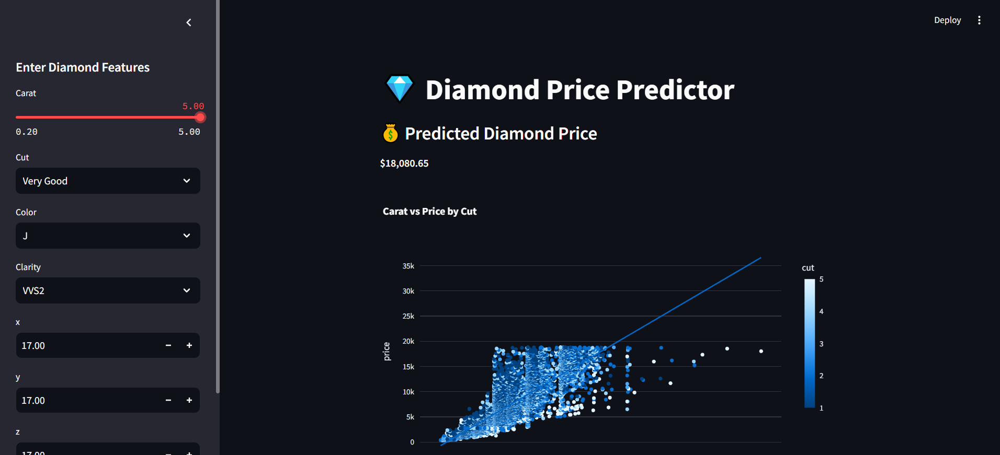

💎 Diamond Price Prediction App
This is a Streamlit web application that predicts the price of a diamond based on its features such as carat, cut, color, clarity, and dimensions (x, y, z). The model is trained using the Random Forest Regressor from scikit-learn and uses the popular diamonds.csv dataset.

📌 Features
Predicts diamond price using a trained Random Forest model.

Interactive sidebar input for diamond features.

Displays predicted price in real-time.

Scatter plot visualization of carat vs price colored by cut.

Automatically handles missing data with mean imputation.

Supports custom user input through a Streamlit UI.

🧠 Model Details
Algorithm: Random Forest Regressor

Target: Diamond Price (price)

Features:

carat

cut (mapped to numerical values)

color (mapped to numerical values)

clarity (mapped to numerical values)

size (x * y * z)

📊 Screenshot / Output Example
You mentioned you have an output screenshot. You can include it like this:

markdown
Copy
Edit

🧑‍💻 Author
Anubhav Choudhary
Passionate Python developer interested in Data Science and Machine Learning.

